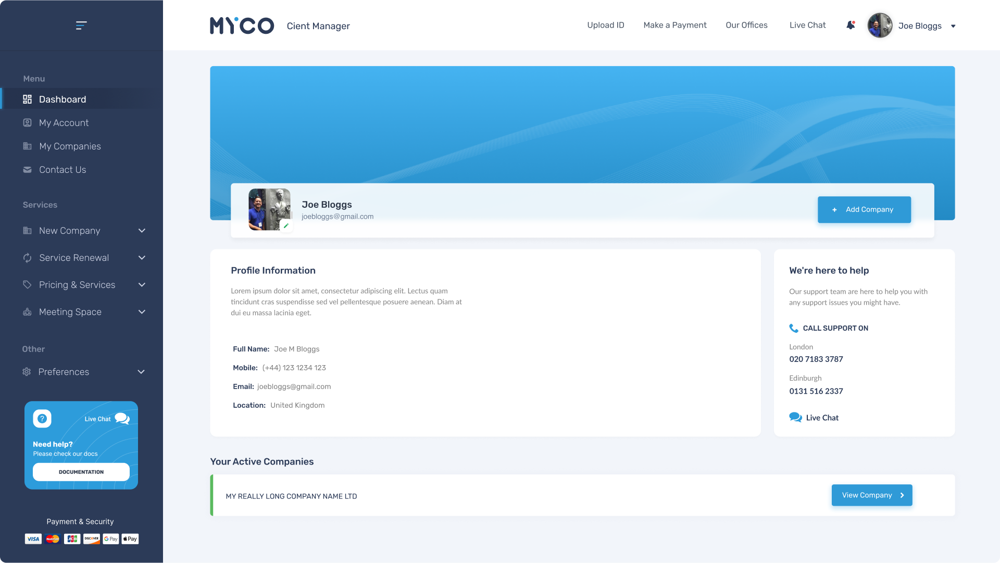

# Client Admin 2022

### Dashboard page: -
#### https://mycoworks22.github.io/Client-Admin-2022/index.html

### Companies page: -
#### https://mycoworks22.github.io/Client-Admin-2022/companies.html

### Single company page: -
#### https://mycoworks22.github.io/Client-Admin-2022/single-company.html

### New company - London: -
#### https://mycoworks22.github.io/Client-Admin-2022/new-company-lnd.html

### Compampany mail: -
#### https://mycoworks22.github.io/Client-Admin-2022/single-company-mail.html

### Compampany messages: -
#### https://mycoworks22.github.io/Client-Admin-2022/single-company-messages.html

### Compampany deleted messages: -
#### https://mycoworks22.github.io/Client-Admin-2022/single-company-messages-deleted.html

### Help center - dashboard: -
#### https://mycoworks22.github.io/Client-Admin-2022/help-centre.html

### Help center - FAQs: -
#### https://mycoworks22.github.io/Client-Admin-2022/faqs.html

### Help center - Guides: -
#### https://mycoworks22.github.io/Client-Admin-2022/guides.html

### Help center - Contact Support: -
#### https://mycoworks22.github.io/Client-Admin-2022/contact-support.html

### Article - Guides:
#### https://mycoworks22.github.io/Client-Admin-2022/article.html

### Upload ID:
#### https://mycoworks22.github.io/Client-Admin-2022/upload-ID.html